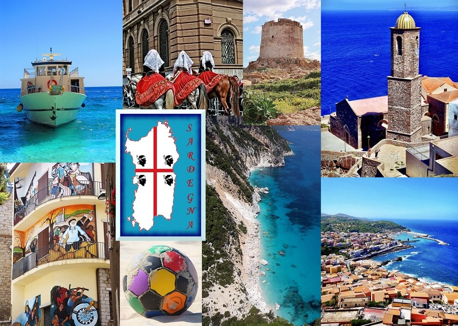
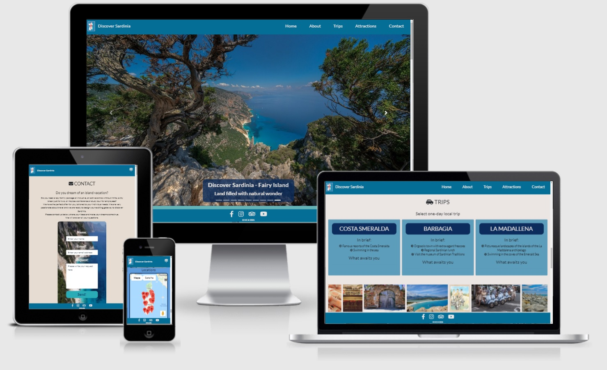
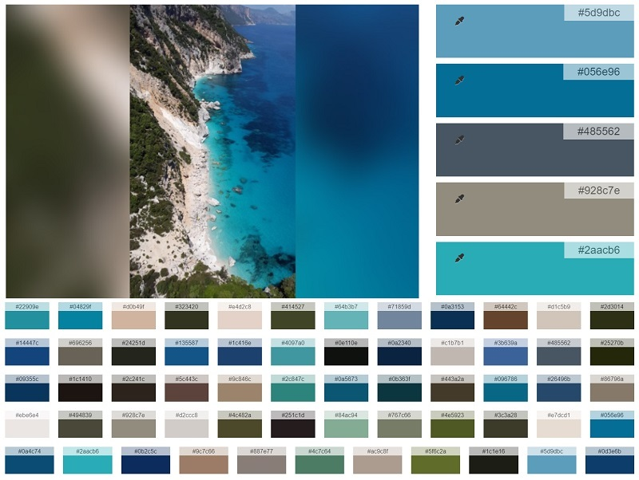
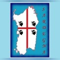
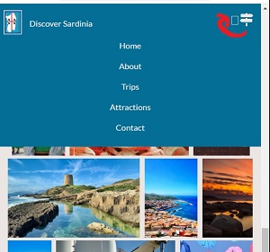
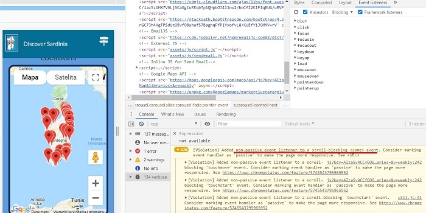

# Discover Sardinia - Fairy Island 

## Table of Contents
1. Project purpose and introduction
2. UXD – User Experience Design
3. Features
4. Technologies and Resources used
5. Testing
6. Project barriers and solutions
7. Version Control
8. Deployment
9. Credits
10. Acknowledgments

# 1. Project purpose and introduction

This project was created to demonstrate the acquisition of broader coding skills as part of the Code Institute Fullstack Web Developer Course. Technologies used during the application development process are mainly: HTML, CSS, JS, with an additional framework such as Bootstrap and library such as jQuery. This project aims to create a responsive website that will activate the user in search of information.

## Discover Sardinia - Fairy Island 

[**View the live project here**](https://maggiedaisy.github.io/Discover-Sardinia/)

Discover Sardinia is an interactive guide of the Italian island located in the central part of the Mediterranean. The purpose of this guide is to demonstrate the tourist attractions offered by the island. This guide can benefit both tourists arriving from other places and the local population. The website offers brief practical and historical information about the island, as well as a local excursion package, maps with key places to see, and a contact form to request an individual offer or other sorts of information. This application is an alternative to large commercial travel agencies and extensive paper guides. Discover Sardinia is a fictional organization, a small travel operator, created for this project with purely scientific purposes. The crew of Discover Sardinia is residents, passionate about active leisure, as well as the history and culture of the island. They have direct access to local attractions, guides, transports, databases, accommodation, and other useful information needed during the trip. Therefore, they can design a trip tailored to the individual needs of tourists. This website is designed in such a way that the user can check it at any time, on the phone on the road, or at home on the computer. The project may be expanded in the future with other, more detailed sections.



# 2. UXD – User Experience Design

### **User Stories**

Potential users of this application are tourists who want to get short and quick information about the island. Mainly individual and group tourists and residents who wish to obtain a detailed and personalized offer about how to effectively spend a free time planning a trip to Sardinia.

* As a user of a website, I wish to be able to navigate very easily, so I can find interesting content
* As a user of the website, I wish to be able to learn about the place and provides services, so I can gain brief orientation about this place
* As a user of the website, I wish to find an accessible contact form, so I can ask for an individual offer via email
* As a user of the website, I wish to find information about places and attractions and view them o the map, so I can have an overview of what suits my personal choices
* As a user of the website, I wish to have visible access to social media, so I can follow after travel company
* As a user of the website, I wish that design is responsive, so I can look at the page on different size of devices

### **Strategy**

The main goal of this website is to promote Sardinia as a place with a mysterious history and big potential for any kind of tourist activity. It aims to be used as an interactive guide to help to navigate main attractions, beaches, hotels, restaurants, as well as a showcase of the one-day local trips. This website is built for a small local tour operator and is dedicated to potential tourists who will be interested in knowing the place itself and the services provided by the tour operator. To improve the way of easy navigation, the website is constructed to be consistent and intuitive. Content is divided into clear, visible sections, and all navigation elements are clickable. The presentation of place and services is giving a clear possibility to find useful information. The design of a website is responsive, so allows viewing page on different devices, as a first-come mobile approach which is very popular for today's generations on the go. Contact form and social media icons can be found very easily during the navigation website process.

### **Scope**

Current and further developing  but still beginner level of designing skill ability, the website provides:
* Clean User Experience by using technologies mentioned in the introduction - HTML, CSS, JavaScript, and API 
* Easy and intuitive navigation, informative content, responsive design, interactive features which are focused on providing a functional space for the user
* Navigation bar with toggle options
* Landing page with self-changeable background images
* Pieces of key information and animated gallery
* Showcase of examples trips to choose with clickable buttons
* Selection of different attractions, beaches, and hotels with interactive map locations
* Contact form with possible sending features
* Footer with social media icons to link to their sites

### **Structure**

The structure of the application is based on meeting the first needs of the potential user. The website is simple structured, learnable, and intuitive, the first interaction enables the quick and easy finding of information and orientation between features. The text content is short and consistent and the imagery is simple and clean, both describe the place, aim, and services very well. All sections allow the user to interact with the site using built-in functions.

### **Skeleton**

[**Wireframes:**](/assets/docs/Sketch_MS2.pdf)

* 1 single page with 5 different content sections and the possibility to navigate between them
* Header – fixed navigation bar with logo and brand name
* 5 main sections called:
* Home – Landing page with hero sliding images
* About – Page with practical and historical information and gallery
* Trips – Showcase of three local trips and gallery
* Attractions – Showcase of attraction and their locations
* Contact – Form to send request and subscribe
* Footer – fixed footer with social media icons 

### **Surface**

The visual experience of this project reflects the theme of happy vacation, spending active and relaxing time by sightseeing and exploring the island

> Colors

A blend of colors is bright and clean, reflecting the colors of seawater and relaxing atmosphere during a sunny day. Throughout the whole project were used two main color shades such as 
- light blue and dark blue
- as well as creamy-sandy beige 
to create visual contrast between elements and sections. 

- Also, two more shades of colors were picked, turquoise and emerald, for hover active elements like buttons, social media icons, active links, and some background colors.



> Typography

- Font **'Lato'** was used for the clean, modern, and transparent experience for the whole body content. Selected from google fonts after recommendations other users that this specific font is good for clear readability and professional layout of travel projects

> Images

The selection of images has been made to present nature, landscapes, architecture, folklore, and the history of the Island. Image presentation shows to potential tourists the attractive places to visit and the entire beauty of this fairy place.

# 3. Features

### Existing Features
* A website with 5 individual and separate sections which are linked together to create a responsive coherent whole
* A fixed-top navbar allows user-easy and intuitive navigation
* A Home landing page shows a selection of hero images with the possibility to navigate to right and left direction
* An About section contains moving gallery presentation and written content
* A Trips section presents 3 choices of trips and clicks buttons to display each option
* An Attractions section contains information about top places to visit and displays them on the map 
* Contact form with a possibility to write and send the actual message, and possibility to subscribe to the newsletter 
* A fixed-bottom footer allows to user clever access to social media

### Features left to implement when skills developed
* Design interactive buttons with dropdown effect to display each group of attractions separately, divided into different sections so that the maps do not seem so crowded
* Enlarge the page with additional sections, more trips choices, and content for alternative attractions, once time stretch is allowing 
* Built a real travel agency web page with a system for booking/reservation, once skills develop in future
* Link to real Social Media which represents the activity of tour operator, once company for cooperation exist and show a willingness to that


# 4. Technologies and Resources used 
* [**Code Institute Fullstack Web Developer Course Content**](https://codeinstitute.net/) - was used as the main source of fundamental knowledge and inspiration.
* [**Code Institute „SLACK” Community**](https://slack.com/intl/en-no/) - was used as a source of assistance.
* **HTML - HTML5 technology** – was used as the main language to create the structure of the Website.
* **CSS - CSS3 technology** – was used as the main language to style the Website.
* **JS - JavaScript technology** – was used as the main language to create the interactive elements of the Website.
* [**Bootstrap**](https://getbootstrap.com/) - Bootstrap framework was used as an open-source to create responsive features and modern design of the Website.
* [**jQuery**](https://jquery.com/) - jQuery library was used as an open-source to create interactive features.
* [**Font Awesome**](https://fontawesome.com/) - Font Awesome Icons were used for social media links and marking separate parts of sections.
* [**Google Fonts**](https://fonts.google.com/specimen/Inconsolata) - Google Font used throughout this project was 'Inconsolata'.
* [**Gitpod**](https://www.gitpod.io/) - Integrated Development Environment was used to develop the Website.
* [**GitHub**](https://github.com/) - GitHub hosting site was used to store the source code for the Website, and Git Pages was used for the deployment of the live version of site.
* [**Git**](https://git-scm.com/) - Git was used as version control software to commit and push code to the GitHub repository where the source code is stored.
* [**Google Maps JavaScript API**](https://developers.google.com/maps) - was used to display a map on the page with markers for main attractions.
* [**EmailJS**](https://www.emailjs.com/) - was used to send an email to the site of the agency right after submission of the contact form.
* [**Stack Overflow**](https://stackoverflow.com/) - was used as a general source of knowledge.
* [**w3schools**](https://www.w3schools.com/howto/default.asp) - especially section 'How to' was used as a general source of knowledge.
* [**Google Chrome Developer Tools**](https://developers.google.com/web/tools/chrome-devtools) - this built-in developer tool was used to inspect page elements and help debug issues with the site layout and test different CSS styles and console JS.
* [**Mobile-Friendly Test Tool**](https://search.google.com/test/mobile-friendly) - The Mobile-Friendly test tool was used to check if aplication is designed for mobile devices.
* [**Balsamiq Wireframe**](https://balsamiq.com/wireframes/) - these quick and handful tool was used to create wireframes for planning project structure and layout.
* [**Am I Responsive Bookmarklet**](http://ami.responsivedesign.is/) - Multi Device Website Mockup Generator was used to create the Mockup image for this README file.
* [**Make a README**](https://www.makeareadme.com/) – a page that shows suggestions on how to create a good Readme file.
* [**Mastering Markdown**](https://guides.github.com/features/mastering-markdown/)– GitHub guide about Markdown. Lightweight and easy-to-use syntax for styling all forms of writing on the GitHub platform.
* [**W3C Markup Validation Service**](https://validator.w3.org/) - validator was used to check the markup validity of content in HTML and CSS.
* [**JSHint**](https://jshint.com/) - was used as tool that helps to detect errors and potential problems in JavaScript code.
* [**Closing Tag Checker for HTML5**](https://www.aliciaramirez.com/closing-tags-checker/) - was used to validate if all tags are open and close correctly.
* [**HTML and CSS and JS Formatter**](https://webformatter.com/html) - was used to beautify code.
* [**MS2 Lead Call**](http://bit.ly/ms2_call_aukje) - Zoom session about planning Milestone Project 2, recorded and posted on Slack by Aukje van der Val  - was used to structure planning steps for this project.
* [**Bootstrap Essentials**](https://ajgreaves.github.io/bootstrap-grid-demo/index.html) - Page developed by Anna Greaves - was used as a source for a better understanding of the grid system.
* [**Grammarly**](https://app.grammarly.com/) - a comprehensive writing tool was used as a helper to write clear and correct text.
* [**iColorpalette**](https://icolorpalette.com/) - has been used as a color picker to create a layout on the Website.
* [**GIMP**](https://www.gimp.org/) - GNU Image Manipulation Program (GIMP) has been used as free & open source image editor to create a logo of the Web.
* **Microsoft Paint** - a simple raster graphics editor has been used for editing and resizing pictures.
* [**FaviconeCodeGenerator**](https://www.faviconcodegenerator.com/) - Favicon Code Generator is Free Online Favicon Converter and has been used to create a little graphic image (icon) associated with a webpage.
* [**MDN Web Docs**](https://developer.mozilla.org/) - documentation repository and learning resource for web developers has been used as a general resource.

# 5. Testing

The final result of this project is a front-end web application based on the principles of user experience design, accessibility, and responsivity. 
**This is an interactive front-end web application developed and implemented by using HTML, CSS and JavaScript with additional Bootstrap and jQuery elements**, so required testing was conducted on the basis of visual effects, website layout and interactive actions which user can take it during navigation.

**General manual and further testing results:** ---> please click [here](tests.md)

> Answering to a user story needs: 

- Tests made on the top located navigation bar shown that every person visiting the site will be able to navigate very easily between sections to find pieces of information. Clickable links are bringing the user to different sections. The navigation bar with active links is available all the time on top of the page, so it is easy to switch and back to desirable content.
- Tests made on the separate sections shown that users will be able to learn about the attractions of the island and services provided by the small local travel company. Additionally, tests performed on trip buttons allow the user to be familiar with possible travel options proposed by the company, and a short-cut button with icons from the About section brings the user directly to the attractions section.  
- Tests made on a contact form allows user to send the real and direct email via an application,  send a request for preparation individual offer and subscribe to the newsletter. The choice was given to the user, is possible to use all these options.
- Tests made on the About, Trips, and Attractions section allows user to find historical and practical information about attractions and successfully view them o the map.
- Tests made on footers social media icons allows user to find visible and easy access to social media. Icons are visible all the time during searching through the application. Clickable links are giving the user possibility to observe and join the local community.
- Tests made on different screen sizes show that the application is responsive, so the user can look at the page on different devices.

# 6. Project barriers and solutions

- During the first steps of development of this page white space was shown up on the right side of the sections page when the background was planned to extend for the full width of the page. This was resolve by adding solution code found on the Stack Overflow page to include in the CSS stylesheet 
```
.container-fluid{
  padding-left: 0rem;
  padding-right: 0rem;
  overflow: hidden;
}
```
- After filling up the contact form and submitting it for sending, I found that all data user info is still there after button action, so I provided a simple function in the sendemail.js file for clearing user information right after clicking send button
```
document.getElementById("responsiveForm").reset();
```
- After checking the application in console developer tools I was running very often for favicon.ico error 404. This was resolve by providing a link in the HTML head tag and generate an icon for this website.



- For this project, a new solution was tried by including an icon for closing the navigation toggle button in CSS, but unfortunately, the type of icon I choose wasn't available for Font Awesome free selection `\f00d`. It was resolved by deleting it because it was displaying as an empty square next to the existing icon for the navigation menu. In my opinion, it would, in general, create a little messy layout also even if it would work properly, so I decided to leave this as a feature to implement again later in the future.



- Providing Google Maps window caused several issues during development. I wanted to create maps with clusters so the general view of the small island is clear and markers do not look crowded and overwhelming on this tiny area.  At the same time, I wanted to provide markers with titles, but the skill level, documentation,  and running out of time, limited me with combining these two solutions. I had to choose what is gonna be more useful for users' experience. I decided to go with maps that will provide info windows about attractions instead of providing maps clusters with just empty markers. I am living this as the biggest project barrier and feature to implement in the future. 


- Another issue during development was that Google Maps window did not display all the time when the page was refreshed. The behavior of this feature was very unexpected, there were hours when this window was visible on deployed git hub pages and at local working space on git pod but for example not on live mobile phone or iPad. Then for another hour, the window was again popping up. The dev tools console shown an error and were pointing to the exact error with API credentials. I tried to resolve it and adjust proper 'urls' to the project in the Google Cloud Platform for accessing API services, but this did not work properly. To display Google Maps in the end I just resign from limitations at the cloud console and I allowed it to work anywhere without restrictions. 


- Unsolved bug: Bugs appearing in console warn about lack of passive event listeners. I never experience this issue before, so I asked for help further but unfortunately, I did not receive any tips on time to adjust any solution. I searched myself for information on how to overcome this issue but none of sources worked for me. 

[**GitHub**](https://github.com/WICG/EventListenerOptions/blob/gh-pages/explainer.md)
[**WebDev**](https://web.dev/uses-passive-event-listeners/?utm_source=lighthouse&utm_medium=devtools)
[**Video**](https://www.youtube.com/watch?v=6-D_3yx_KVI)



# 7. Version Control

**Git** - free and open-source distributed **Version Control System** was used to show tracking all changes during the coding process. 
`Git add`, `Git commit`, `Git push` commands were used to approve and store files in the repository. 

# 8. Deployment

This project was developed by using **GitHub** - a code hosting platform and **Gitpod** - an online Integrated Development Environment. There is no difference between the deployed version and the development version.

The first step was to create a new "Repository" named Discover Sardinia (MS2) in GitHub. Then once opened in Gitpod the whole process started by creating a structure of files and then the very first boilerplate of code, then successively with time whole code structure. Next, the code was pushed to GitHub where was stored in my Repository.
### Deployment using GitHub pages:
* Navigate to the Git Hub Repository - **My Repository**
* Then, right under the "Settings" section of the GitHub repository, scroll down to "GitHub Pages" section
* After, select a "master branch" under "source" drop-down and click "save" button
* Once selected, this publishes the project to GitHub Pages and then you can click to URL link to go directly to the live deployed page
### How to use Run Locally:
* The code can be also run locally, optional through clone or download 
* Navigate and open the repository, click on the green "Code" button, and select either "clone" or "download"
* The Clone option provides a URL, which you can use on your desktop IDE
* The Download ZIP option provides a link to download a ZIP file that can be unzipped, unpacked, and displayed on your local computer

# 9. Credits

> Content

The text content for this page was created by student Malgorzata Czerwonka (self-written) for a **non-existing company**, and for **educational purposes only**. Inspiration to create informative and consistent content was borrowed from following sources:
- [**Voyagetips.com**](https://www.voyagetips.com/en/things-to-do-in-sardinia/) - Best things to do in Sardinia, recomendations and useful tips for travelers
- [**Sardegna.com**](https://www.sardegna.com/) - an Alpitour company specialised in holidays in Sardinia
- [**WonderfulSardinia.com**](https://www.wonderfulsardinia.com/) - is a destination and booking portal dedicated to exclusive holidays in Sardinia.

> Media

All the images used in this site were picked from:

- [**Unsplash**](https://unsplash.com/) - a website dedicated to sharing stock photography for free for every kind of project

- [**Pixabay**](https://pixabay.com/) - a stunning free images & royalty free stock

To create a logo I borrowed first flag template and developed further in GIMP:

- [**FAVPNG**](https://favpng.com/png_view/charles-albert-of-sardinia-flag-of-sardinia-regions-of-italy-sardinian-people-png/1aQdepzq) - a database of free transparent PNG Images 

> Code

- Code inspiration for responsive and interactive navigation bar borrowed from - [**Responsive Navigation Menu Bar with HTML CSS & Javascript | CSS Flexbox - Tutorial by CodingNepal**](https://www.youtube.com/watch?v=mbDNrvKLAGM)
- Code inspiration for background slider on the landing Home page borrowed from - [**Carousel Slider Bootstrap 5 | Slider Carousel - Tutorial by Adrian Twarog**](https://www.youtube.com/watch?v=ku_97a6Bgkg)
- Code inspiration for gallery effects in About and Trips section borrowed from -  [**Dublin Unlocked - Project for CI by Shane Keran**](https://shanekeran.github.io/dublin-unlocked/)
- Code inspiration for buttons in a Trips section borrowed from - [**JQuery Effects - Challenge 3" - Course by Code Institute**](https://courses.codeinstitute.net/courses/course-v1:CodeInstitute+IFD101+2017_T3/courseware/b99394c03fb342ed96e82caa5adef426/cb6592e199ef45d5a3db4cf83691b70f/?child=first)
- Code inspiration for map locations of attractions borrowed from - CI course content walkthrough "Adding The Map Element (Bootstrap 4)" and [**Google Maps JavaScript API Tutorial" by Traversy Media**](https://www.youtube.com/watch?v=Zxf1mnP5zcw)
- Code inspiration for send email js borrowed from - CI course content walkthrough "Connecting To The EmailJS Service Using Their SDK"

# 10. Acknowledgments

- Inspiration for this project was the previous career experience in the tourism department and accession to the course itself 
- I would like to thank: Code Institute tutors for creating inspiring content for the course, Slack Community for being available and helpful every single time when needed, especially students and leaders like Aukje for constructive zoom session about how to approach MS2

