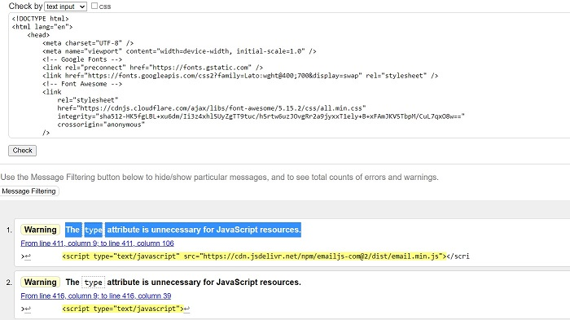
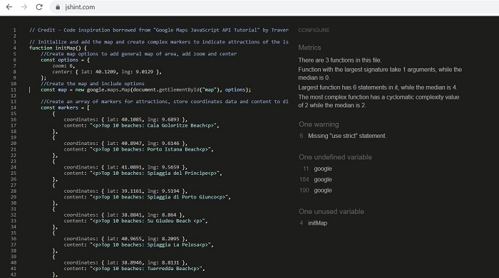
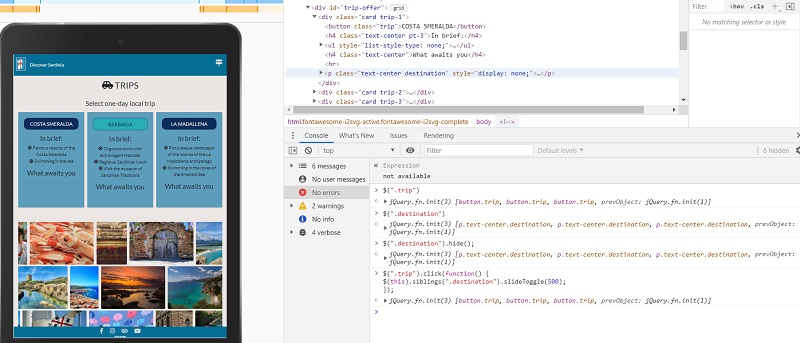
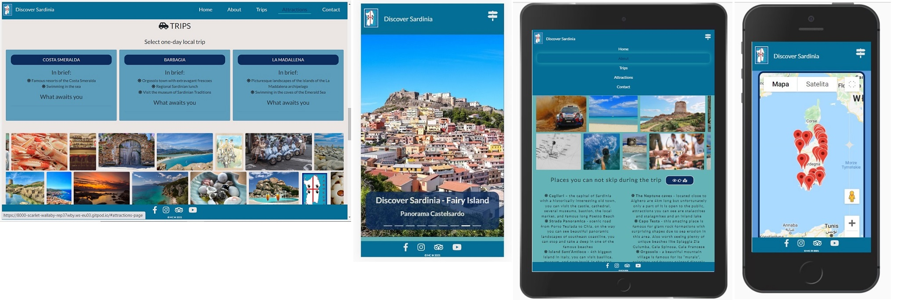
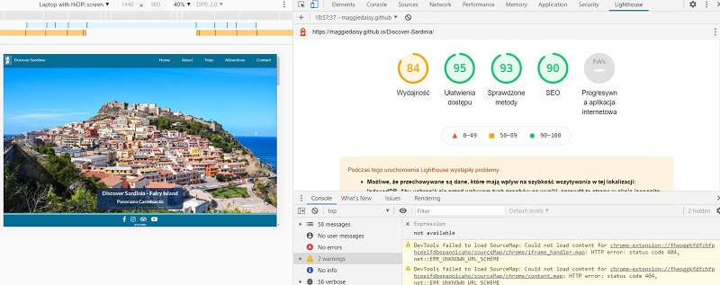
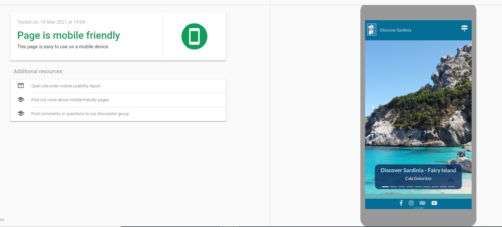

# Manual testing on features

The first step of the testing process was to create the basic framework of this application and check if the attached links for navigation between sections work properly. Then the application was developed successively, section by section. During the development process, all the features were checked after they were included. Last proper manual testing included one more detailed checking if everything works as expected.

1. **Brand name link and Home link** - has been checked and confirmed that directs the user successfully to the home page.
2. **All links settled in the top navigation nav bar** - have been checked that allow the user to navigate between individual sections like Home, About, Trips, Attractions, Contact.
3. **Carousel at Home sections** - has been checked that right and left arrows buttons work properly and gives a user visual experience together with the experience of interaction. Users can just wait and watch hero landing images or make them move faster.
4. **Button nested at the About section** - has been checked and ensured that directs the user short way from content to Attractions section. 
5. **Buttons nested at the Trips section** - has been checked and ensured that shows and hides desirable content, user can decide to choose to explore the trips or scroll to another section.
6. **The scrolling gallery** - was checked that runs properly on different devices and is responsive and eye-catching for the user who expects an engaging visual experience. 
7. **Google Maps window included in the Attractions section** - has been checked that displays properly and shows all markers together with selected attractions titles, users can easily click at separate markers and get a brief orientation about recommended attractions.
8. **Contact form in the Contact section** - has been checked and ensured that works as expected, Submit/Send button without entering the required e-mail address shows error and asks the user to fill out this field with input. Also, e-mail address input when tested with the wrong format shows an error and asks the user to fill out the correct input with @. The newsletter agrees on the button was checked and as a result, allows users to make choices about sending information about events organized in the shop. In addition, a test refers to sending a request to the actual provider of services. Sending email works properly via platform what was proven by sending and receiving a message in the attached inbox. After submitting this contact form user gets an actual response directly on the screen which shows that emails were sent with success. Tests showed also that form clearing up from data after pushing a send button. 
9. **Social media icons settled in the footer** - has been checked and ensured that points the user to social media main pages and opens in a new tab.

# Validation 
When the site developed closer to the final stage, the next test was to check eventually errors in a code validation.
- **HTML** - passing code into The W3C Markup Validation Service brought two warnings, about type attribute for javascript sources provided for linking emailjs, this was solved by simply removing them from the script tag and testing the whole code again, otherwise no errors occurred during this test.

- **CSS** - passing code into The W3C CSS Validation Service - Jigsaw brought no errors.
- **Java Script** - passing code to JSHint a static code analysis tool for JavaScript returned some metrics about missing "use strict" statement and single undefined and unused variable, this happened specifically when testing file maps.js but despite this, the functionality of code worked for the application. Testing all files with JS brought no errors, just informative metrics, and warnings as above.

 Variables were tested also by logging them to the console to check them after every instance. 

 

# Other Tests
- **Google Chrome Developer Tools** - The further tests of the application were about to check responsiveness in all sections using devtools. Multiple tests on multiple desktop sizes confirmed that a structure works quite well on mobile devices as well as bigger desktop sizes. The tests were conducted mainly with the use of the Google Chrome browser. However, the research also covered other browsers such as Mozilla Firefox, Microsoft Edge, and Apple Safari. In general, after inspecting by use of the tools available in each browser, it was found that the application displays correctly and is responsive to different screen sizes. 

| Browser | Device | Compatibility |
| --- | --- | --- |
| Google Chrome | HP Spectre 13 | no problems occurred |
| Mozilla Firefox | HP Spectre 13 | no problems occurred |
| Microsoft Edge | HP Spectre 13 | no problems occurred |
| Apple Safari | iPad 5th gen | no problems occurred |

- In addition, the test was performed live on devices such as Huawei P20, Samsung Galaxy S10, iPhone 11, iPad 9.7, HP Spectre 13, Asus Zenbook UX32A, iMac. The result was very good and shown that on all those screen devices website was responsive and displayed as expected.

- **Lighthouse web.dev** - Further tests were done by using Lighthouse open source, the performance result was quite good, no common issues were shown about timing, interactions, accesibility, only one tip to watch sizing of images, but since the application is loaded with pictures the general score was on an acceptable level. 

- **Google Mobile-Friendly Test Tool** - Continuing subsequent tests included a test on mobile devices such as mobile phones, the entire application was checked with Google Mobile-Friendly Test Tool and showed that the design is friendly to such devices.

- **Grammarly** - Final tests were about to check grammar and spelling throughout the whole site and Readme file, section by section text was run through Grammarly application and showed several errors to correct.
